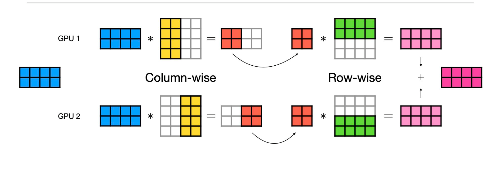
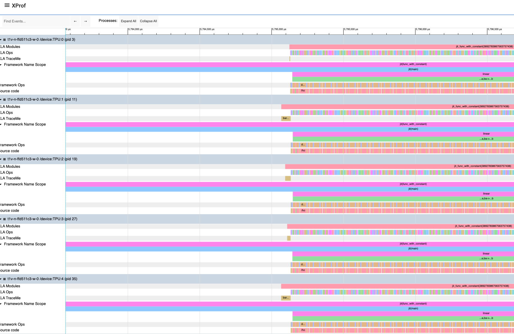

# 如何在 JAX 中运行 Hugging Face 模型（第二部分）

在[上一篇文章](01-run-huggingface-model-in-jax-zh.md)中，我们探讨了如何使用 Hugging Face 和 JAX 对 Llama 模型执行**前向传播**。这次，我们将实现相同的目标，但是通过**同时使用八个设备**。

-----

## 张量并行入门

我们将采用的并行化方案称为**张量并行（Tensor Parallelism）**，有时也被称为 **NeMo-Megatron 分片**。



[Lightning AI 的这份文档](https://lightning.ai/docs/pytorch/stable/advanced/model_parallel/tp.html)对此有出色的解释。核心思想是我们可以执行两个矩阵乘法（matmuls）——一个按列分片，另一个按行分片——**只需要一次集合操作（all-reduce）**。

### 张量并行的工作原理

在深度学习中，大型模型通常由多个线性层组成。张量并行通过以下方式工作：

1. **按列分片的矩阵乘法（Column-wise sharding）**：
   - 将权重矩阵 W (shape: [d_in, d_out]) 按列分割成 N 份
   - 每个设备持有 W_i (shape: [d_in, d_out/N])
   - 计算 Y_i = X @ W_i（每个设备独立计算）
   - 无需通信！每个设备的输出直接用于下一层

2. **按行分片的矩阵乘法（Row-wise sharding）**：
   - 将权重矩阵 W (shape: [d_in, d_out]) 按行分割
   - 每个设备持有 W_i (shape: [d_in/N, d_out])
   - 计算部分结果 Y_i = X_i @ W_i
   - 需要 All-Reduce 操作来汇总所有设备的结果

3. **组合策略**：
   - 第一个 matmul：按列分片（无通信）
   - 第二个 matmul：按行分片（一次 all-reduce）
   - 这样可以最小化通信开销

### 分片方案

因此，我们可以根据以下方案对权重进行分片：

* **对于注意力块（Attention Block）：**

  1. **Q、K 和 V 投影**按**列**分片（因为它们代表第一个 matmul）
  2. **O 投影**按**行**分片（因为它是第二个 matmul）
  3. **注意力机制**本身不需要通信，因为它是纯数据并行的（头的数量被分片）

* **对于前馈网络（FFNs）：**

  1. **Up 和 Gate 投影**按**列**分片
  2. **Down 投影**按**行**分片

### 为什么这样分片？

让我们用一个具体的例子来理解：

假设我们有一个简单的两层网络：
```
Input (batch, seq_len, hidden_dim)
  ↓
Layer 1: Linear (hidden_dim → intermediate_dim)  # 按列分片
  ↓
Activation
  ↓
Layer 2: Linear (intermediate_dim → hidden_dim)  # 按行分片
  ↓
Output (batch, seq_len, hidden_dim)
```

**按列分片 Layer 1**：
- 设备 0 计算前半部分的 intermediate_dim
- 设备 1 计算后半部分的 intermediate_dim
- 无需通信！

**按行分片 Layer 2**：
- 设备 0 使用前半部分的中间结果
- 设备 1 使用后半部分的中间结果
- 需要 All-Reduce 来组合最终结果

-----

## JAX 并行支持入门

### gSPMD 模式

与 PyTorch 不同，JAX 的并行支持使用 **gSPMD（通用单程序多数据）模式**。这意味着：

**PyTorch 方式（传统 SPMD）**：
- 每个设备一个进程
- 手动管理集合操作（all-reduce、all-gather 等）
- 显式数据分发和同步

**JAX 方式（gSPMD）**：
- 单个程序控制所有设备
- 只需指定 `mesh`（设备网格）和分片方式
- XLA 编译器自动插入必要的集合操作

### gSPMD 的优势

1. **简化编程模型**：无需手动管理进程间通信
2. **自动优化**：编译器可以优化通信模式
3. **更少的错误**：减少了手动管理带来的同步问题

详细过程在这里有非常详细的描述：[JAX 分布式数组和自动并行化](https://docs.jax.dev/en/latest/notebooks/Distributed_arrays_and_automatic_parallelization.html)。

### 实现并行的两个关键要素

本质上，要并行运行我们的模型，我们需要两个关键要素：

1. **定义一个 `mesh`（网格）**：在我们的例子中，它只是 `jax.make_mesh((jax.device_count(), ), ('axis', ))`。注意，我们给轴的名称对功能影响不大，但有助于代码可读性。

2. **知道模型的每个权重是如何分片的**。

### Mesh 的概念

Mesh 是 JAX 中组织设备的方式。可以想象成一个多维网格：

```python
# 1D mesh: 8 个设备排成一行
mesh_1d = jax.make_mesh((8,), ('data',))

# 2D mesh: 8 个设备排成 2x4 的网格
mesh_2d = jax.make_mesh((2, 4), ('data', 'model'))

# 在我们的例子中，使用 1D mesh
mesh = jax.make_mesh((jax.device_count(),), ('axis',))
```

为了弄清楚第二点，让我们打印出模型的权重并决定它们的分片方式。

-----

## 权重分片

### 检查模型权重

让我们打印权重以了解我们正在处理什么。在 `weights, func = torchax.extract_jax(model)` 之后添加以下代码：

```python
for name, w in weights.items():
  print(name, w.shape)
```

我们将得到类似这样的输出：

```
model.rotary_emb.inv_freq (64,)
model.embed_tokens.weight (32000, 4096)
model.layers.0.self_attn.q_proj.weight (4096, 4096)
model.layers.0.self_attn.k_proj.weight (4096, 4096)
model.layers.0.self_attn.v_proj.weight (4096, 4096)
model.layers.0.self_attn.o_proj.weight (4096, 4096)
model.layers.0.mlp.gate_proj.weight (11008, 4096)
model.layers.0.mlp.up_proj.weight (11008, 4096)
model.layers.0.mlp.down_proj.weight (4096, 11008)
model.layers.0.input_layernorm.weight (4096,)
model.layers.0.post_attention_layernorm.weight (4096,)
model.layers.1.self_attn.q_proj.weight (4096, 4096)
...
```

### 理解权重维度

- **Embedding 层**: `(32000, 4096)` - 词汇表大小 × 隐藏维度
- **Q/K/V 投影**: `(4096, 4096)` - 隐藏维度 × 隐藏维度
- **O 投影**: `(4096, 4096)` - 隐藏维度 × 隐藏维度
- **FFN Gate/Up**: `(11008, 4096)` - 中间维度 × 隐藏维度
- **FFN Down**: `(4096, 11008)` - 隐藏维度 × 中间维度

### 分片标注

权重跨越 32 层。根据我们之前的讨论，我们需要按如下方式对它们进行分片：

```
model.layers.0.self_attn.q_proj.weight (4096, 4096) -> ('axis', None)
model.layers.0.self_attn.k_proj.weight (4096, 4096) -> ('axis', None)
model.layers.0.self_attn.v_proj.weight (4096, 4096) -> ('axis', None)
model.layers.0.self_attn.o_proj.weight (4096, 4096) -> (None, 'axis')
model.layers.0.mlp.gate_proj.weight (11008, 4096) -> ('axis', None)
model.layers.0.mlp.up_proj.weight (11008, 4096) -> ('axis', None)
model.layers.0.mlp.down_proj.weight (4096, 11008) -> (None, 'axis')
```

**分片说明**：
- `('axis', None)` 表示沿第一个维度（行）分片，第二个维度复制
- `(None, 'axis')` 表示第一个维度复制，沿第二个维度（列）分片
- `P()` 表示完全复制（不分片）

### 为什么这样标注？

以 q_proj 为例，权重形状是 `(4096, 4096)`：
- 标注为 `('axis', None)` 意味着：
  - 在 8 个设备上，每个设备持有 `(512, 4096)` 的权重
  - 输入 `(batch, seq_len, 4096)` 被复制到所有设备
  - 每个设备计算 `(batch, seq_len, 512)` 的输出
  - 拼接后得到完整的 `(batch, seq_len, 4096)` 输出

### 实现分片函数

除了讨论的权重外，还有嵌入权重和最终输出投影的权重。对于这些，我们在分片上有更大的灵活性。

现在，我们可以这样编写分片函数：

```python
from jax.sharding import NamedSharding, PartitionSpec as P

def shard_weights_llama(mesh, weights):
  """
  为 Llama 模型的权重应用张量并行分片
  
  参数:
    mesh: JAX 设备网格
    weights: 模型权重字典
  
  返回:
    分片后的权重字典
  """
  result = {}
  for k, v in weights.items():
    # Q、K、V、Gate、Up 投影：按列分片
    if (('q_proj' in k) or
        ('k_proj' in k) or
        ('v_proj' in k) or
        ('gate_proj' in k) or
        ('up_proj' in k)):
      sharding = P('axis', None)
    # O、Down、LM Head、Embedding：按行分片
    elif(('o_proj' in k) or
        ('down_proj' in k) or
        ('lm_head.weight' in k) or
        ('embed_tokens' in k)):
      sharding = P(None, 'axis')
    # 其他权重（LayerNorm 等）：完全复制
    else:
      sharding = P() # replicated
    result[k] = jax.device_put(v, NamedSharding(mesh, sharding))
  return result
```

### 分片函数详解

让我们深入理解这个函数：

```python
# 创建分片规范
sharding = P('axis', None)  # 第一维沿 'axis' 分片，第二维复制

# 将数组放置到设备上并应用分片
result[k] = jax.device_put(v, NamedSharding(mesh, sharding))
```

**`jax.device_put` 的作用**：
1. 将数组分发到多个设备
2. 根据 sharding 规范切分数据
3. 返回一个逻辑上统一但物理上分布的数组

**NamedSharding 的优势**：
- 使用命名轴（如 'axis'）而不是数字索引
- 更易读和维护
- 可以轻松重新配置分片方案

然后，我们可以使用 `weights = shard_weights_llama(mesh, weights)` 对权重进行分片。

-----

## 再次运行

### 准备输入数据

现在权重已经分片，我们几乎准备好以分布式方式运行推理了！还有一步：输入也需要在每个设备上可用，以便所有设备都可以使用它进行计算。我们可以通过复制输入来实现这一点：

```python
model_inputs.input_ids = jax.device_put(
  model_inputs.input_ids, NamedSharding(mesh, P())) # replicate
```

**为什么复制输入？**

- 输入数据 `(batch, seq_len)` 需要在所有设备上可用
- 每个设备使用相同的输入，但使用不同的权重分片
- `P()` 表示完全复制（所有设备持有相同的副本）

### 完整的分布式推理代码

```python
import jax
import torchax
from transformers import AutoModelForCausalLM, AutoTokenizer
from jax.sharding import NamedSharding, PartitionSpec as P
import time

# 加载模型
model = AutoModelForCausalLM.from_pretrained(
    "meta-llama/Llama-2-7b-hf", 
    torch_dtype="bfloat16", 
    device_map="cpu"
)
tokenizer = AutoTokenizer.from_pretrained("meta-llama/Llama-2-7b-hf")

# 转换为 JAX
weights, func = torchax.extract_jax(model)

# 创建设备网格
mesh = jax.make_mesh((jax.device_count(),), ('axis',))

# 分片权重
weights = shard_weights_llama(mesh, weights)

# 准备输入
model_inputs = tokenizer(["The secret to baking a good cake is "], return_tensors="jax")
model_inputs.input_ids = jax.device_put(
    model_inputs.input_ids, NamedSharding(mesh, P()))

# 创建 JIT 编译的函数
def forward_pass(weights, input_ids):
    return func(weights, (input_ids,), {'use_cache': False})

jitted_func = jax.jit(forward_pass)

# 性能测试
for i in range(3):
    start = time.time()
    res = jitted_func(weights, model_inputs.input_ids)
    jax.block_until_ready(res)
    end = time.time()
    print(f"{i} {end - start} seconds")
```

### 性能结果

再次运行脚本会产生：

```
0 5.062012195587158 seconds
1 0.0038039684295654297 seconds
2 0.0034346580505371094 seconds
```

这比单设备版本**快约 4.3 倍**。🚀

### 性能分析

**为什么不是 8 倍加速？**

理想情况下，使用 8 个设备应该获得 8 倍加速，但实际上只有 4.3 倍。原因包括：

1. **通信开销**：All-reduce 操作需要时间
2. **负载不平衡**：某些操作可能无法完美并行
3. **内存带宽限制**：设备间数据传输的瓶颈
4. **未分片的操作**：LayerNorm 等操作是复制的

**单设备性能对比**（从第一部分）：
- 第一次运行（含编译）：4.37 秒
- 后续运行：0.013 秒

**8 设备性能**：
- 第一次运行（含编译）：5.06 秒
- 后续运行：0.0038 秒（**3.4 倍快于单设备**）

-----

## 如何确保它真的在 8 个设备上运行？

### 使用 JAX Profiler

虽然我们看到了推理速度的提升，但它不是完整的 8 倍加速。为了确认它确实利用了所有 8 个设备并理解为什么加速不是线性的，我们可以使用 [JAX profiler](https://docs.jax.dev/en/latest/profiling.html)。

要捕获性能分析，只需使用标准的 JAX API 包装相关代码部分：

```python
with jax.profiler.trace("/tmp/jax-trace", create_perfetto_link=False):
  # 您的推理代码在这里
  for i in range(3):
    start = time.time()
    res = jitted_func(weights, model_inputs.input_ids)
    jax.block_until_ready(res)
    end = time.time()
    print(f"{i} {end - start} seconds")
```

### 分析工具选择

**Perfetto**（推荐用于本地机器）：
```python
with jax.profiler.trace("/tmp/jax-trace", create_perfetto_link=True):
    # 代码
```
- 会生成一个 Perfetto 链接
- 在浏览器中打开可视化
- 交互式时间线视图

**TensorBoard**（适合远程服务器）：
```python
with jax.profiler.trace("/tmp/jax-trace", create_perfetto_link=False):
    # 代码

# 然后运行
# tensorboard --logdir=/tmp/jax-trace
```

### 性能分析示例

由于在远程机器上，我使用了 TensorBoard 的 xprof 插件而不是 Perfetto。无论如何，结果都是这样的视觉表示：



### 如何解读性能分析图

从这个输出中，您可以：

1. **验证设备活动**：
   - 确认所有 8 个设备都处于活动状态
   - 查看每个设备的利用率

2. **识别操作**：
   - 查看哪些操作在每个设备上运行
   - 了解操作的执行顺序

3. **发现瓶颈**：
   - 识别通信开销（All-reduce 操作）
   - 发现负载不平衡
   - 找出空闲时间

4. **优化机会**：
   - 看哪些操作占用最多时间
   - 确定可以进一步优化的部分

### 性能分析的关键指标

**查找内容**：
- **设备利用率**：所有设备都在工作吗？
- **通信时间**：All-reduce 占用多少时间？
- **计算时间**：实际计算占用多少时间？
- **空闲时间**：设备等待的时间

**优化目标**：
- 最大化设备利用率
- 最小化通信开销
- 平衡各设备的负载

### 重现结果

要重现本文的内容，请运行：
```python
python jax_hg_02.py
```

-----

## 高级话题：更复杂的分片方案

### 2D 并行：数据并行 + 张量并行

在实际应用中，您可能想要结合多种并行策略：

```python
# 创建 2D mesh: 2 个数据并行 × 4 个模型并行
mesh = jax.make_mesh((2, 4), ('data', 'model'))

# 权重分片
def shard_weights_2d(mesh, weights):
    result = {}
    for k, v in weights.items():
        if 'q_proj' in k:
            # 只在模型维度分片，数据维度复制
            sharding = P(None, 'model')
        elif 'o_proj' in k:
            # 在模型维度分片
            sharding = P('model', None)
        # ... 其他权重
        result[k] = jax.device_put(v, NamedSharding(mesh, sharding))
    return result

# 输入分片
# 在数据维度分片（batch）
input_sharding = P('data', None)
model_inputs.input_ids = jax.device_put(
    model_inputs.input_ids, 
    NamedSharding(mesh, input_sharding)
)
```

### 流水线并行

对于非常大的模型，您还可以添加流水线并行：

```python
# 3D mesh: 数据并行 × 张量并行 × 流水线并行
mesh = jax.make_mesh((2, 2, 2), ('data', 'model', 'pipeline'))

# 将不同的层放在不同的流水线阶段
def shard_with_pipeline(mesh, weights):
    result = {}
    for k, v in weights.items():
        # 根据层号确定流水线阶段
        layer_num = extract_layer_number(k)
        pipeline_stage = layer_num // 16  # 假设 32 层分成 2 个阶段
        
        # ... 应用分片
        result[k] = jax.device_put(v, sharding)
    return result
```

-----

## 最佳实践和技巧

### 1. 选择合适的分片策略

```python
# 对于小模型（< 1B 参数）
# 使用简单的数据并行
mesh = jax.make_mesh((jax.device_count(),), ('data',))

# 对于中型模型（1B - 10B 参数）
# 使用张量并行
mesh = jax.make_mesh((jax.device_count(),), ('model',))

# 对于大型模型（> 10B 参数）
# 使用 2D 或 3D 并行
mesh = jax.make_mesh((2, 4), ('data', 'model'))
```

### 2. 验证分片正确性

```python
# 检查权重分片
for k, v in weights.items():
    print(f"{k}: {v.sharding}")

# 检查是否真的分片了
assert v.sharding.is_fully_sharded or v.sharding.is_fully_replicated
```

### 3. 监控内存使用

```python
# 打印每个设备的内存使用
for device in jax.devices():
    mem_info = device.memory_stats()
    print(f"Device {device.id}: {mem_info['bytes_in_use'] / 1e9:.2f} GB")
```

### 4. 调试分片问题

```python
# 使用 jax.debug 查看分片
import jax.debug as jdb

def debug_forward(weights, input_ids):
    jdb.print("Input sharding: {}", input_ids.sharding)
    result = func(weights, (input_ids,), {'use_cache': False})
    jdb.print("Output sharding: {}", result.logits.sharding)
    return result
```

-----

## 常见问题解答

### Q: 为什么我的加速比不是线性的？

A: 非线性加速的常见原因：
1. **通信开销**：设备间数据传输需要时间
2. **Amdahl 定律**：部分代码无法并行化
3. **负载不平衡**：某些设备可能比其他设备工作更多
4. **内存带宽**：可能受限于内存访问速度

### Q: 如何选择分片维度？

A: 一般原则：
- **权重矩阵**：根据计算图选择（列分片 vs 行分片）
- **激活值**：通常在 batch 维度分片（数据并行）
- **梯度**：应该与权重的分片方式匹配

### Q: 我可以在单个 GPU 上测试分片代码吗？

A: 可以！JAX 可以模拟多个设备：
```python
import os
os.environ['XLA_FLAGS'] = '--xla_force_host_platform_device_count=8'
# 现在 jax.device_count() 会返回 8，即使您只有 1 个 GPU
```

### Q: 如何处理动态形状？

A: 对于动态形状（如可变序列长度），考虑：
1. **填充到固定长度**：最简单但可能浪费计算
2. **Bucketing**：将相似长度的序列分组
3. **动态分片**：在每次迭代时重新分片（较慢）

### Q: 分片是否影响数值精度？

A: 理论上不应该，但要注意：
1. **All-reduce 顺序**：浮点运算不完全满足结合律
2. **舍入误差**：分布式计算可能有轻微的数值差异
3. **建议**：使用相同的种子并验证输出

-----

## 结论

我们成功展示了如何在**不修改模型核心代码**的情况下，以**分布式方式**运行 Llama 模型的前向传播。关键在于简单地指定权重应该如何分片。我们还展示了如何使用标准的 JAX 性能分析工具来确认分布式执行并帮助进行性能分析。

### 关键要点

✅ **张量并行**：通过分片权重实现模型并行
✅ **gSPMD**：JAX 的自动并行化简化了编程
✅ **性能提升**：在 8 个设备上获得约 4.3 倍加速
✅ **易于实现**：只需定义 mesh 和分片规范
✅ **性能分析**：使用 JAX profiler 验证和优化

### 未来方向

在下一篇文章中，我们将对 HuggingFace diffusers 库中的模型执行相同的操作，展示这种方法的通用性。

-----

## 扩展阅读

### JAX 并行化资源

1. **官方文档**：
   - [JAX 分布式数组](https://docs.jax.dev/en/latest/notebooks/Distributed_arrays_and_automatic_parallelization.html)
   - [JAX sharding 教程](https://docs.jax.dev/en/latest/sharded-computation.html)

2. **性能优化**：
   - [JAX 性能分析](https://docs.jax.dev/en/latest/profiling.html)
   - [XLA 优化指南](https://www.tensorflow.org/xla/performance)

3. **并行策略**：
   - [Megatron-LM 论文](https://arxiv.org/abs/1909.08053)
   - [GPipe 论文](https://arxiv.org/abs/1811.06965)

### 实践项目

1. **实验不同的分片策略**：
   - 尝试 2D 并行（数据 + 模型）
   - 比较不同配置的性能

2. **扩展到其他模型**：
   - GPT 系列模型
   - BERT 和 encoder-only 模型
   - 多模态模型

3. **优化通信**：
   - 实现梯度累积
   - 尝试混合精度训练
   - 优化 all-reduce 模式