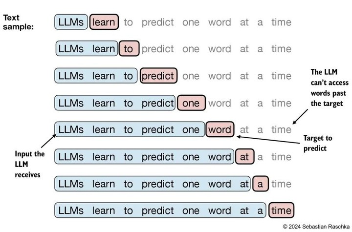

# 如何在 JAX 中运行 Hugging Face 模型（第三部分）

在之前的文章中（[第一部分](01-run-huggingface-model-in-jax-zh.md) 和 [第二部分](02-run-huggingface-model-distributed-zh.md)），我们探讨了如何调用 HuggingFace 模型的 `forward` 函数。现在让我们看看如何运行其自回归解码函数。但在此之前，让我们先深入了解 `torchax` 的工作原理。

在开始之前，如果我们按照之前的示例安装了 `torchax`，请通过以下方式从 GitHub 重新安装：
transformers 需要特地版本

```bash
pip install git+https://github.com/google/torchax.git
pip install transformers==4.48.0
```

因为在编写本文时发现了一些最近的 bug 修复。

-----

## torchax 的工作原理

### 表面现象 vs 实际机制

`torchax` 看起来像是在将 PyTorch 模型转换为 JAX 函数，但实际上它做的是不同的事情。具体来说，它用自定义包装器装饰 JAX 数组，使其看起来像 `torch.Tensor`。

然后，当调用 `torch.nn.Module` 时，它认为接收的是 `torch.Tensor` 作为输入，但我们实际上偷偷放进去的是 `jax.Array`！


这就像特洛伊木马一样——外表看起来是 PyTorch Tensor，内部实际上是 JAX Array！

### 深入理解：Environment 和 Tensor

现在让我们不使用 `extract_jax` API，而是直接使用 `torchax` 的 `Environment` 和 `Tensor` 来看看到底发生了什么。

```python
import torch
import torchax as tx
import jax
import jax.numpy as jnp

# torchax 环境使 PyTorch 操作能够在 torchax 的 Tensor 上工作
env = tx.default_env()

# 从 JAX 数组开始：
arr = jnp.ones((4, 4))

# 直接在 JAX 数组上调用 torch 函数会出错
# torch.matmul(arr, arr)  # 这会报错！

# 将 arr 转换为 Tensor
tensor = tx.interop.torch_view(arr)

print(isinstance(tensor, torch.Tensor))  # 打印 True
print(tensor.__dict__)
```

运行结果：

```
Is torch Tensor: True
inner data of my tensor {'_elem': Array([[1., 1., 1., 1.],
       [1., 1., 1., 1.],
       [1., 1., 1., 1.],
       [1., 1., 1., 1.]], dtype=float32), '_env': <torchax.tensor.Environment object at 0x772f8cd67fd0>}
```

### 解析结果

从这里我们可以看到：
1. 从 JAX Array 转换的 tensor **确实是** `torch.Tensor` 类型
2. 但它内部持有的是我们原始的 JAX Array（存储在 `_elem` 字段中）
3. 它还记住了所属的环境对象（默认情况下与 `tx.default_env()` 相同）

### 在 torchax Tensor 上运行 PyTorch 操作

现在我们可以尝试在这个 tensor 上运行一些 PyTorch 操作。为此，我们首先需要激活环境，然后在其中运行操作：

```python
with env:
  print(torch.matmul(tensor, tensor))
  print(torch.sin(tensor))
  print(torch.exp(tensor))
```

我们得到结果。注意这不是常规的 `torch.Tensor`，而是内部有 `jax.Array` 的那种：

```
Tensor(<class 'jaxlib._jax.ArrayImpl'> [[4. 4. 4. 4.]
 [4. 4. 4. 4.]
 [4. 4. 4. 4.]
 [4. 4. 4. 4.]])
Tensor(<class 'jaxlib._jax.ArrayImpl'> [[0.841471 0.841471 0.841471 0.841471]
 [0.841471 0.841471 0.841471 0.841471]
 [0.841471 0.841471 0.841471 0.841471]
 [0.841471 0.841471 0.841471 0.841471]])
Tensor(<class 'jaxlib._jax.ArrayImpl'> [[2.7182817 2.7182817 2.7182817 2.7182817]
 [2.7182817 2.7182817 2.7182817 2.7182817]
 [2.7182817 2.7182817 2.7182817 2.7182817]
 [2.7182817 2.7182817 2.7182817 2.7182817]])
```

### 创建 torchax Tensor 的另一种方式

除了通过包装 JAX Array 来创建 `torchax.Tensor`，另一种方法是在常规 `torch.Tensor`（在 CPU 上）上调用 `.to('jax')`。

因此，编写上述示例的另一种方式是：

```python
with env:
  tensor = torch.ones((4,4)).to('jax')
  print(torch.matmul(tensor, tensor))
  print(torch.sin(tensor))
  print(torch.exp(tensor))
```

### 运行完整示例

您可以通过运行以下命令重现上述示例：

```bash
python torchax-demo.py
```

### 核心原理总结

**机器学习模型是由 torch 操作组成的计算图。因此，如果每个 torch 操作都在我们的 Tensor 变体上运行，那么我们就实现了在 JAX 之上运行 torch 模型。**

这是一个优雅的设计：
1. **无需修改模型代码**：模型仍然使用标准的 PyTorch API
2. **透明的后端切换**：JAX 作为后端执行实际计算
3. **最佳的两个世界**：PyTorch 的易用性 + JAX 的性能

-----

## 使用新 API 重写之前的示例

现在，让我们通过构造 tensor 和调用 torch 模型来重写我们在之前文章中看到的示例。

```python
# 将模型的权重移动到 'jax' 设备，即一个内部有 JAX 数组的 tensor
with env:
  model.to('jax')
  weights = shard_weights_llama(mesh, model.state_dict())
  input_ids = model_inputs.input_ids.to('jax').apply_jax_(
    jax.device_put,
    NamedSharding(mesh, P()))
  tx.interop.call_jax(jax.block_until_ready, weights)
  print(model(input_ids))
```

### 逐步解析

让我们详细分析上面发生的事情：

1. **`model.to('jax')`**：
   - 将 torch 模型的权重移动到特殊的 'jax' 设备
   - 类似于 `model.to('cuda')` 使用 CUDA 后端
   - 一旦发生这种情况，tensor 类型将变为 `torchax.Tensor`
   - 这个 tensor 类有一个额外的方法：`apply_jax_`，它将任何 JAX 函数应用于内部的 JAX 数组

2. **权重分片**：
   - 模型中的权重仍然是未分片的
   - 所以我们使用上次使用的相同分片方法对它们进行分片

3. **调用模型**：
   - 我们像调用任何 PyTorch 模型一样调用模型
   - 得到预期的结果

### 执行结果

```
CausalLMOutputWithPast(loss=None, logits=Tensor(<class 'jaxlib._jax.ArrayImpl'> [[[-12.950611    -7.4854484   -0.42371067 ...  -6.819363    -8.073828
    -7.5583534 ]
  [-13.508438   -11.716616    -6.9578876  ...  -9.135823   -10.237023
    -8.56888   ]
  [-12.8517685  -11.180469    -4.0543456  ...  -7.9564795  -11.546011
   -10.686134  ]
  ...
  [ -2.983235    -5.621302    11.553352   ...  -2.6286669   -2.8319468
    -1.9902805 ]
  [ -8.674949   -10.042385     3.4400458  ...  -3.7776647   -8.616567
    -5.7228904 ]
  [ -4.0748825   -4.706395     5.117742   ...   6.7174563    0.5748794
     2.506649  ]]]), past_key_values=DynamicCache(), hidden_states=None, attentions=None)
```

完美！我们得到了与之前相同的结果。

-----

## 用形状解释自回归解码

### LLM 的基本工作原理

LLM（大语言模型）被训练来预测给定输入句子的下一个 token。



### 输入输出形状

给定长度为 `n` 的输入序列：
- **输入**：形状为 `(1, n)` 的张量（其中 1 是 batch size）
- **输出**：也是形状为 `(1, n)` 的张量，用于预测下一个 token
- **关注点**：我们只关心最后一个 token 的预测

### 迭代过程

下一步是将这个 token 附加到原始输入，形成形状为 `(1, n + 1)` 的输入序列，然后我们重复这个过程 `m` 次迭代，或者直到模型产生停止信号，通常是 `句子结束（eos）` token。

换句话说，LLM 的输入和输出形状是：

```
迭代 1: (1, n)     -> (1, n)
迭代 2: (1, n + 1) -> (1, n + 1)
迭代 3: (1, n + 2) -> (1, n + 2)
...
```

**关键观察**：每次迭代的形状都在变化。

### 形状变化的问题

这种动态形状变化对 JAX 的 JIT 编译提出了挑战：
- JAX 的 JIT 需要固定的输入形状
- 每次形状改变都会触发重新编译
- 这会严重降低性能

-----

## 使用 KV Cache 进行解码

### 为什么需要 KV Cache？

熟悉 LLM 推理的人会指出，通常的自回归解码设置会使用 `KVCache`。[这篇文章](https://medium.com/@plienhar/llm-inference-series-4-kv-caching-a-deeper-look-4ba9a77746c8) 对此有很好的解释。

### KV Cache 的核心思想

主要思想是：
- **观察**：迭代 1 只产生了一个新 token
- **关键**：这是模型唯一没见过的 token
- **优化**：我们可以将之前见过的 token 编码到缓存中并重用一些计算

### 简单类比

想象你在读一本书：
- **没有缓存**：每次读新段落时，都要重新理解整本书
- **有缓存**：你记住了之前读过的内容，只需理解新段落

### KV Cache 的输入输出

在使用 KVCache 的推理设置中，模型的输入和输出大致如下：

```
迭代 1: (1, n)          -> (1, n),     kvcache(n)
迭代 2: (1, 1), kvcache(n)   -> (1, 1),     kvcache(n + 1)
迭代 3: (1, 1), kvcache(n + 1) -> (1, 1),     kvcache(n + 2)
...
```

### KV Cache 的结构

这里我使用符号 `kvcache(n)` 来表示序列长度为 `n` 的 kvcache。

**完整形状**：
```
(batch_size, num_heads, sequence_length, head_dim) × num_layers × 2
```

**为什么乘以 2？**
- 每层有 Key 和 Value 两个缓存
- K（Key）和 V（Value）分别存储

### 实际检查 KV Cache 的形状

让我们实际运行模型并检查 KV cache 的形状：

```python
print('number of layers', len(res[1]))
for k, v in res[1]:
  print(k.shape, v.shape)
```

我们可以看到：

```
number of layers 32
torch.Size([1, 32, 12, 128]) torch.Size([1, 32, 12, 128])
torch.Size([1, 32, 12, 128]) torch.Size([1, 32, 12, 128])
torch.Size([1, 32, 12, 128]) torch.Size([1, 32, 12, 128])
torch.Size([1, 32, 12, 128]) torch.Size([1, 32, 12, 128])
...
```

### 解释 KV Cache 维度

对于 Llama-2 模型：
- **层数**：32 层
- **注意力头数**：32 个头
- **形状解释**：`[batch_size, num_heads, seq_len, head_dim]`
  - `1`：batch size
  - `32`：注意力头数
  - `12`：当前序列长度
  - `128`：每个头的维度

### 使用 KV Cache 进行自回归解码

我们可以通过传回下一个 token 和缓存来进行自回归解码：

```python
print('number of layers', len(res[1]))
for k, v in res[1]:
  print('first kv cache')
  print(k.shape, v.shape)
  break

# 贪婪采样：选择概率最高的 token
next_token = torch.argmax(res[0][:, -1], dim=-1)

# 使用缓存进行下一次预测
res = model(next_token.unsqueeze(0), past_key_values=res[1])
print('number of layers', len(res[1]))
for k, v in res[1]:
  print('second kv cache')
  print(k.shape, v.shape)
  break
```

### 采样策略说明

**贪婪采样（Greedy Sampling）**：
- 总是选择概率最高的 token
- 简单但可能不够多样化

**其他采样策略**：
```python
# Top-k 采样
top_k_logits, top_k_indices = torch.topk(logits, k=50)
probs = torch.softmax(top_k_logits, dim=-1)
next_token = top_k_indices[torch.multinomial(probs, 1)]

# Top-p (nucleus) 采样
sorted_logits, sorted_indices = torch.sort(logits, descending=True)
cumulative_probs = torch.cumsum(torch.softmax(sorted_logits, dim=-1), dim=-1)
# ... (选择累积概率在 p 内的 tokens)

# 温度采样
temperature = 0.7
scaled_logits = logits / temperature
probs = torch.softmax(scaled_logits, dim=-1)
next_token = torch.multinomial(probs, 1)
```

### Cache 增长验证

输出结果：

```
number of layers 32
first kv cache
torch.Size([1, 32, 12, 128]) torch.Size([1, 32, 12, 128])
number of layers 32
second kv cache
torch.Size([1, 32, 13, 128]) torch.Size([1, 32, 13, 128])
```

我们看到 dynamic cache 的大小增长了 1。

### Dynamic Cache 与 JAX JIT

**问题**：
- `jax.jit` 不喜欢变化的形状（会重新编译！）
- 如果我们继续使用 `DynamicCache`，只能使用 eager 模式进行推理

**解决方案预告**：
- 使用 `StaticCache`（固定最大长度）
- 避免重新编译

### 实现完整的自回归解码

```python
def autoregressive_decode(model, input_ids, tokenizer, max_tokens=50):
  """使用 Dynamic Cache 的自回归解码（eager 模式）"""
  start = time.perf_counter()
  
  # 第一次前向传播
  res = model(input_ids)
  next_token = torch.argmax(res[0][:, -1], dim=-1)
  result_tokens = [int(next_token.item())]

  # 迭代生成
  for _ in range(max_tokens):
    res = model(next_token.unsqueeze(0), past_key_values=res[1])
    next_token = torch.argmax(res[0][:, -1], dim=-1)
    if next_token.item() == tokenizer.eos_token:
      break
    result_tokens.append(next_token.item())
  
  end = time.perf_counter()
  
  print('decoded', tokenizer.batch_decode([result_tokens]))
  print(f'took {end - start} seconds')
  return result_tokens
```

### 执行结果

```
decoded ['100% in the ingredients.\nI've been baking cakes for as long as I can remember. I've always loved the process of baking and the smell of freshly baked cakes.\nI']
took 130.90283443999942 seconds
```

**分析**：
- ✅ 模型成功生成了文本
- ❌ 130 秒完成一个请求太慢了
- 💡 需要使用 `jax.jit` 来加速

-----

## Static Cache 和 jax.jit

### Dynamic Cache 的问题

`jax.jit` 和上面使用的 `DynamicCache` 的问题是：
- 每次迭代的输入和输出形状都在变化
- 盲目应用 `jax.jit` 会比 eager 模式更慢
- 原因：需要重新编译计算图运行一次，然后丢弃

### Static Cache 的引入

幸运的是，HuggingFace 有一个设置可以使用 `StaticCache`——一个具有固定最大长度的缓存，因此我们可以避免重新编译。

根据 [LLM 推理优化](https://huggingface.co/docs/transformers/v4.44.0/en/llm_optims?static-kv=advanced+usage%3A+control+Static+Cache#static-kv-cache-and-torchcompile) 文档，`StaticCache` 正是为了支持 `torch.compile` 而引入的；它也喜欢静态形状。

### Static Cache 的工作原理

```python
# 创建固定大小的缓存
cache = StaticCache(
    config=model.config,
    max_batch_size=1,
    max_cache_len=100,  # 固定最大长度
    device='jax',
    dtype=model.dtype
)

# 使用缓存
for i in range(max_tokens):
    # cache 的形状始终是 (1, num_heads, 100, head_dim)
    # 但只有前 i 个位置是有效的
    logits, cache = model(token, past_key_values=cache, ...)
```

### 实现 Static Cache 解码

我们编写以下函数来测试：

**注意**：Python 代码看起来更复杂，但它是从 HuggingFace 的 [LLM 推理优化](https://huggingface.co/docs/transformers/v4.44.0/en/llm_optims?static-kv=advanced+usage%3A+control+Static+Cache#static-kv-cache-and-torchcompile) 文档中复制的。

```python
from transformers.cache_utils import StaticCache

def autoregressive_decode_static(model, input_ids, tokenizer, max_tokens=50):
  """使用 Static Cache 的自回归解码"""
  
  def decode_one_tokens(cur_token, input_pos, cache_position, past_key_values):
    """解码单个 token"""
    logits, cache = model(
        cur_token,
        position_ids=input_pos,
        cache_position=cache_position,
        past_key_values=past_key_values,
        return_dict=False,
        use_cache=True
    )
    new_token = torch.argmax(logits[:, -1], dim=-1)[:, None]
    return new_token, cache

  batch_size, seq_length = input_ids.shape
  with torch.no_grad():
    start = time.perf_counter()
    
    # 创建 Static Cache
    past_key_values = StaticCache(
        config=model.config, 
        max_batch_size=1, 
        max_cache_len=max_tokens, 
        device='jax', 
        dtype=model.dtype
    )
    cache_position = torch.arange(seq_length, device='jax')
    generated_ids = []

    # 第一次前向传播（处理整个输入序列）
    logits, past_key_values = model(
        input_ids, 
        cache_position=cache_position, 
        past_key_values=past_key_values, 
        return_dict=False, 
        use_cache=True
    )
    next_token = torch.argmax(logits[:, -1], dim=-1)[:, None]
    generated_ids.append(next_token[:, 0].item())

    # 自回归生成
    cache_position = torch.tensor([seq_length + 1], device='jax')
    for _ in range(1, max_tokens):
        next_token, past_key_values = decode_one_tokens(
          next_token.clone(), None, cache_position, past_key_values)
        generated_ids.append(next_token.int().item())
        cache_position += 1
    
    end = time.perf_counter()

  text = tokenizer.batch_decode(generated_ids, skip_special_tokens=True)
  print(text)
  print('Time: ', end - start)
```

### Static Cache 代码详解

**关键参数**：

1. **max_cache_len**：
   - 预分配的缓存长度
   - 必须 >= 实际生成的序列长度
   - 权衡：更大 = 更多内存，更小 = 可能不够用

2. **cache_position**：
   - 跟踪当前写入缓存的位置
   - 允许重用固定大小的缓存

3. **position_ids**：
   - 告诉模型 token 的位置
   - 对位置编码很重要

### 执行结果

```
['1', '0', '0', '%', 'but', 'ter', '.', '\n', 'I', ''', 'm', 'not', 'sure', 'if', 'it', ''', 's', 'the', 'but', 'ter', 'or', 'the', 'eggs', ',', 'but', 'I', ''', 'm', 'pretty', 'sure', 'it', ''', 's', 'the', 'but', 'ter', '.', '\n', 'I', ''', 's', '\n', 'I', ''', 's', '\n', 'I', ''', '\n', 'I']
Time:  88.39702287199907
```

**分析**：
- ✅ 得到了相同的输出
- ✅ 更快的时间（88 秒 vs 130 秒）
- 💡 还没有尝试编译！

-----

## 现在让我们进行 JIT 编译

### 使用 torchax.interop.jax_jit

要使用 `jax.jit` 编译函数，我们可以使用 `torchax.interop.jax_jit` 辅助函数。

我们对上述函数进行以下更改：

```python
# 在定义 decode_one_tokens 后添加这一行
jitted = tx.interop.jax_jit(decode_one_tokens)

# 替换这一行
- next_token, past_key_values = decode_one_tokens(
# 为这一行：
+ next_token, past_key_values = jitted(
```

换句话说，我们正在 jit 编译 `decode_one_tokens`，并用 jitted 函数替换对它的调用。

### jax_jit vs jax.jit

**为什么使用 `tx.interop.jax_jit` 而不是 `jax.jit`？**

- `jax.jit` 作用于 JAX 函数（接受和返回 `jax.Array` 的函数）
- `tx.interop.jax_jit` 作用于 torch 函数（接受和返回 `torch.Tensor` 的函数）

```python
# JAX 函数
def jax_func(x):  # x 是 jax.Array
    return jax.numpy.sin(x)  # 返回 jax.Array
jitted_jax = jax.jit(jax_func)

# Torch 函数
def torch_func(x):  # x 是 torch.Tensor
    return torch.sin(x)  # 返回 torch.Tensor
jitted_torch = tx.interop.jax_jit(torch_func)
```

### 遇到的错误

运行时，我们发现了这个错误：

```
Traceback (most recent call last):
  File "/home/hanq_google_com/learning_machine/jax-huggingface/jax_hg_03.py", line 201, in <module>
    autoregressive_decode_static(model, input_ids, tokenizer)
  File "/home/hanq_google_com/learning_machine/jax-huggingface/jax_hg_03.py", line 177, in autoregressive_decode_static
    next_token, past_key_values = jitted(
  File "/home/hanq_google_com/pytorch/xla/torchax/torchax/interop.py", line 220, in call_jax
    res: JaxValue = jax_func(*args, **kwargs)
TypeError: Error interpreting argument to functools.partial(<function call_torch at 0x7d1cea648af0>, <function autoregressive_decode_static.<locals>.decode_one_tokens at 0x7d1c86d0e440>) as an abstract array. The problematic value is of type <class 'transformers.cache_utils.StaticCache'> and was passed to the function at path args[3].
This typically means that a jit-wrapped function was called with a non-array argument, and this argument was not marked as static using the static_argnums or static_argnames parameters of jax.jit.
```

### 错误 1：又是 Pytree 问题

回想[第一部分](01-run-huggingface-model-in-jax-zh.md)，我们遇到了完全相同的问题，即 `StaticCache` 需要在 pytree 中注册。

要做到这一点，我们添加以下内容：

```python
from jax.tree_util import register_pytree_node
from transformers import cache_utils

def _flatten_static_cache(cache):
  """展平 Static Cache"""
  return (
      cache.key_cache,
      cache.value_cache,
  ), (cache._config, cache.max_batch_size, cache.max_cache_len)

def _unflatten_static_cache(aux, children):
  """重建 Static Cache"""
  cache = cache_utils.StaticCache(*aux)
  cache._config = aux[0]
  cache.key_cache, cache.value_cache = children
  return cache

register_pytree_node(
  cache_utils.StaticCache,
  _flatten_static_cache,
  _unflatten_static_cache,
)
```

### Pytree 注册详解

**children vs aux_data**：
- **children**：需要被 JAX 转换的数据（如 Arrays）
  - `key_cache`, `value_cache`
- **aux_data**：静态元数据，不会被转换
  - `_config`, `max_batch_size`, `max_cache_len`

### 下一个错误：捕获的常量

再次运行，似乎卡住了，出现以下消息：

```
/home/hanq_google_com/venv/lib/python3.10/site-packages/jax/_src/interpreters/mlir.py:1135: UserWarning: A large amount of constants were captured during lowering (13.48GB total). If this is intentional, disable this warning by setting JAX_CAPTURED_CONSTANTS_WARN_BYTES=-1. To obtain a report of where these constants were encountered, set JAX_CAPTURED_CONSTANTS_REPORT_FRAMES=-1.
```

### 理解常量捕获问题

**发生了什么？**

当您使用 `jax.jit` 时，任何在函数中使用但**不作为输入参数传递**的数据都将作为常量内联到计算图中。

**为什么这是个问题？**
1. **大常量使计算图变大**
2. **可能使编译时间更长**
3. **有时会导致指令缓存 OOM**

### 识别问题

我们只有一个应用了 `jax.jit`（通过 `tx.interop.jax_jit`）的函数：

```python
def decode_one_tokens(cur_token, input_pos, cache_position, past_key_values):
```

仔细查看，我们注意到**模型权重**（一大块数据）没有列在输入参数中。让我们修复它。

### 解决方案：使用 torch.func.functional_call

将 `decode_one_tokens` 替换为：

```python
def decode_one_tokens(model_weights, cur_token, input_pos, cache_position, past_key_values):
  """
  解码单个 token
  
  参数:
    model_weights: 模型权重（作为输入传递以避免常量捕获）
    cur_token: 当前 token
    input_pos: 位置 ID
    cache_position: 缓存位置
    past_key_values: KV cache
  """
  logits, cache = torch.func.functional_call(
      model, 
      model_weights,  # 权重 state_dict
      (cur_token,),   # args 作为元组
      dict(
        position_ids=input_pos,
        cache_position=cache_position,
        past_key_values=past_key_values,
        return_dict=False,
        use_cache=True) # kwargs 作为字典
  )
  new_token = torch.argmax(logits[:, -1], dim=-1)[:, None]
  return new_token, cache
```

### torch.func.functional_call 详解

[`torch.func.functional_call`](https://docs.pytorch.org/docs/stable/generated/torch.func.functional_call.html) 允许我们：

1. **临时替换模型权重**：
   ```python
   # 不修改原始模型
   output = torch.func.functional_call(model, new_weights, inputs)
   ```

2. **无状态调用**：
   - 模型的 `forward` 方法被调用
   - 但使用提供的权重而不是 `model.parameters()`

3. **对 JIT 友好**：
   - 权重作为显式输入
   - 不会被捕获为常量

### 更新调用代码

现在调用时需要传递 `model_weights`：

```python
# 获取模型权重
model_weights = model.state_dict()

# 在循环中使用
for _ in range(1, max_tokens):
    next_token, past_key_values = jitted(
        model_weights,  # 添加权重参数
        next_token.clone(), 
        None, 
        cache_position, 
        past_key_values
    )
    generated_ids.append(next_token.int().item())
    cache_position += 1
```

### 最终性能结果

再次运行，我们得到：

```
['1', '0', '0', '%', 'but', 'ter', '.', '\n', 'I', ''', 'm', 'not', 'sure', 'if', 'it', ''', 's', 'the', 'but', 'ter', 'or', 'the', 'eggs', ',', 'but', 'I', ''', 'm', 'pretty', 'sure', 'it', ''', 's', 'the', 'but', 'ter', '.', '\n', 'I', ''', 's', '\n', 'I', ''', 's', '\n', 'I', ''', '\n', 'I']
Time:  14.7717966591008
```

**性能对比**：
- Dynamic Cache (eager): 130 秒
- Static Cache (eager): 88 秒
- Static Cache (JIT): **14.8 秒** ⚡

**加速比**：
- 相比 Dynamic Cache: 8.8x
- 相比 Static Cache eager: 6x

这快多了！完整的重现位于 [jax_hg_03.py](jax_hg_03.py)。

-----

## 深入理解：采样策略

### 贪婪采样的局限性

我们一直使用贪婪采样（`argmax`），但这有局限性：
- 总是选择最可能的 token
- 缺乏多样性
- 可能产生重复的文本

### Top-k 采样

```python
def top_k_sampling(logits, k=50, temperature=1.0):
    """
    Top-k 采样：从概率最高的 k 个 token 中采样
    
    参数:
        logits: 模型输出的 logits
        k: 保留的 top token 数量
        temperature: 温度参数（越高越随机）
    """
    # 1. 应用温度
    logits = logits / temperature
    
    # 2. 获取 top k
    top_k_logits, top_k_indices = torch.topk(logits, k)
    
    # 3. 计算概率
    probs = torch.softmax(top_k_logits, dim=-1)
    
    # 4. 采样
    sampled_index = torch.multinomial(probs, 1)
    next_token = top_k_indices[sampled_index]
    
    return next_token

# 使用示例
next_token = top_k_sampling(logits[:, -1], k=50, temperature=0.8)
```

### Top-p (Nucleus) 采样

```python
def top_p_sampling(logits, p=0.9, temperature=1.0):
    """
    Top-p (nucleus) 采样：从累积概率达到 p 的最小 token 集合中采样
    
    参数:
        logits: 模型输出的 logits
        p: 累积概率阈值
        temperature: 温度参数
    """
    # 1. 应用温度
    logits = logits / temperature
    
    # 2. 排序
    sorted_logits, sorted_indices = torch.sort(logits, descending=True)
    
    # 3. 计算累积概率
    probs = torch.softmax(sorted_logits, dim=-1)
    cumulative_probs = torch.cumsum(probs, dim=-1)
    
    # 4. 移除累积概率超过 p 的 token
    sorted_indices_to_remove = cumulative_probs > p
    # 保持至少一个 token
    sorted_indices_to_remove[..., 0] = False
    
    # 5. 创建掩码
    indices_to_remove = sorted_indices_to_remove.scatter(
        -1, sorted_indices, sorted_indices_to_remove
    )
    logits[indices_to_remove] = float('-inf')
    
    # 6. 采样
    probs = torch.softmax(logits, dim=-1)
    next_token = torch.multinomial(probs, 1)
    
    return next_token

# 使用示例
next_token = top_p_sampling(logits[:, -1], p=0.9, temperature=0.8)
```

### 组合策略

```python
def combined_sampling(logits, top_k=50, top_p=0.9, temperature=0.8):
    """组合 top-k 和 top-p 采样"""
    # 1. 温度
    logits = logits / temperature
    
    # 2. Top-k 过滤
    top_k_logits, top_k_indices = torch.topk(logits, top_k)
    
    # 3. Top-p 过滤（在 top-k 结果上）
    probs = torch.softmax(top_k_logits, dim=-1)
    cumulative_probs = torch.cumsum(probs, dim=-1)
    
    # 移除累积概率超过 p 的
    indices_to_remove = cumulative_probs > top_p
    indices_to_remove[..., 0] = False
    top_k_logits[indices_to_remove] = float('-inf')
    
    # 4. 重新计算概率并采样
    probs = torch.softmax(top_k_logits, dim=-1)
    sampled_index = torch.multinomial(probs, 1)
    next_token = top_k_indices.gather(-1, sampled_index)
    
    return next_token
```

### 采样策略对比

| 策略 | 优点 | 缺点 | 适用场景 |
|------|------|------|----------|
| **贪婪** | 确定性、快速 | 缺乏多样性、可能重复 | 需要确定性输出 |
| **Top-k** | 控制多样性、简单 | k 值难以调整 | 一般文本生成 |
| **Top-p** | 自适应、更自然 | 计算稍慢 | 高质量文本生成 |
| **组合** | 平衡性能和质量 | 更多超参数 | 生产环境 |

-----

## 完整示例：带多种采样策略的生成

```python
def generate_with_options(
    model, 
    tokenizer, 
    prompt,
    max_length=50,
    method='greedy',  # 'greedy', 'top_k', 'top_p', 'combined'
    temperature=1.0,
    top_k=50,
    top_p=0.9
):
    """
    完整的生成函数，支持多种采样策略
    """
    # 编码输入
    input_ids = tokenizer.encode(prompt, return_tensors='pt')
    
    # 创建 Static Cache
    past_key_values = StaticCache(
        config=model.config,
        max_batch_size=1,
        max_cache_len=max_length,
        device='jax',
        dtype=model.dtype
    )
    
    generated = input_ids[0].tolist()
    cache_position = torch.arange(input_ids.shape[1], device='jax')
    
    # 第一次前向传播
    with torch.no_grad():
        logits, past_key_values = model(
            input_ids,
            cache_position=cache_position,
            past_key_values=past_key_values,
            return_dict=False,
            use_cache=True
        )
    
    # 选择采样方法
    if method == 'greedy':
        next_token = torch.argmax(logits[:, -1], dim=-1)
    elif method == 'top_k':
        next_token = top_k_sampling(logits[:, -1], k=top_k, temperature=temperature)
    elif method == 'top_p':
        next_token = top_p_sampling(logits[:, -1], p=top_p, temperature=temperature)
    elif method == 'combined':
        next_token = combined_sampling(logits[:, -1], top_k=top_k, top_p=top_p, temperature=temperature)
    
    generated.append(next_token.item())
    
    # 继续生成
    cache_position = torch.tensor([input_ids.shape[1]], device='jax')
    for _ in range(max_length - input_ids.shape[1]):
        with torch.no_grad():
            logits, past_key_values = model(
                next_token.unsqueeze(0),
                cache_position=cache_position,
                past_key_values=past_key_values,
                return_dict=False,
                use_cache=True
            )
        
        # 应用相同的采样方法
        if method == 'greedy':
            next_token = torch.argmax(logits[:, -1], dim=-1)
        elif method == 'top_k':
            next_token = top_k_sampling(logits[:, -1], k=top_k, temperature=temperature)
        elif method == 'top_p':
            next_token = top_p_sampling(logits[:, -1], p=top_p, temperature=temperature)
        elif method == 'combined':
            next_token = combined_sampling(logits[:, -1], top_k=top_k, top_p=top_p, temperature=temperature)
        
        if next_token.item() == tokenizer.eos_token_id:
            break
        
        generated.append(next_token.item())
        cache_position += 1
    
    # 解码
    return tokenizer.decode(generated)

# 使用示例
prompt = "The secret to baking a good cake is"

print("贪婪采样:")
print(generate_with_options(model, tokenizer, prompt, method='greedy'))

print("\nTop-k 采样:")
print(generate_with_options(model, tokenizer, prompt, method='top_k', temperature=0.8))

print("\nTop-p 采样:")
print(generate_with_options(model, tokenizer, prompt, method='top_p', temperature=0.8))

print("\n组合采样:")
print(generate_with_options(model, tokenizer, prompt, method='combined', temperature=0.8))
```

-----

## 常见问题解答

### Q: Static Cache 的 max_cache_len 应该设置为多少？

A: 考虑因素：
- **最大可能的序列长度**：设置为您预期的最大值
- **内存限制**：更大的缓存消耗更多内存
- **建议**：max_input_length + max_new_tokens

### Q: 为什么需要 torch.func.functional_call？

A: 原因：
1. **避免常量捕获**：权重作为输入而不是闭包变量
2. **无状态调用**：不修改原始模型
3. **JIT 友好**：明确的数据流

### Q: 可以对整个生成循环进行 JIT 吗？

A: 技术上可以，但有挑战：
- 循环长度需要固定
- 提前停止（遇到 EOS）会很复杂
- 通常只 JIT 单步函数更实用

### Q: 如何处理批处理生成？

A: 修改代码支持批处理：
```python
# 创建批处理缓存
past_key_values = StaticCache(
    max_batch_size=batch_size,  # 增加 batch size
    max_cache_len=max_length,
    ...
)

# 处理可变长度序列
# 使用注意力掩码和填充
```

### Q: 性能瓶颈在哪里？

A: 常见瓶颈：
1. **第一次前向传播**：处理整个输入序列
2. **大型 KV Cache**：内存带宽
3. **采样**：复杂的采样策略可能较慢

-----

## 总结

本文展示了：

### 关键成就

✅ **理解 torchax 的工作原理**：JAX 数组伪装成 PyTorch Tensor
✅ **实现自回归解码**：使用 KV Cache 优化
✅ **Static Cache**：避免形状变化，支持 JIT
✅ **成功 JIT 编译**：8.8x 加速（相比 Dynamic Cache）
✅ **避免常量捕获**：使用 `torch.func.functional_call`

### 性能总结

| 方法 | 时间（秒） | 加速比 |
|------|-----------|--------|
| Dynamic Cache (eager) | 130.9 | 1x |
| Static Cache (eager) | 88.4 | 1.48x |
| **Static Cache (JIT)** | **14.8** | **8.8x** |

### 关键技术

1. **Pytree 注册**：支持自定义类型
2. **Static Cache**：固定形状，支持 JIT
3. **functional_call**：避免常量捕获
4. **jax_jit**：编译 PyTorch 函数

### 下一步

在下一篇文章中，我们将对 HuggingFace diffusers 库中的模型做同样的事情，展示这种方法对图像生成模型的适用性。

敬请期待！